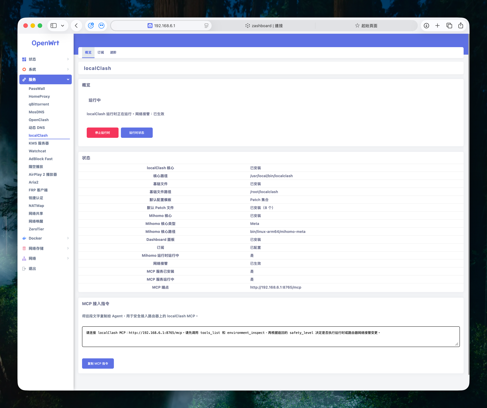

# localclash-luci

OpenWrt LuCI package for localClash.

This repository owns the OpenWrt integration layer:

- LuCI frontend views.
- rpcd ACL and helper methods.
- OpenWrt package/feed metadata.
- Router-side bootstrap and service integration needed before and after the
  localClash core is installed.

It does not ship the localClash Go core, Mihomo core, dashboard assets,
subscriptions, generated configuration, or runtime state. Those are installed
or managed through explicit user actions and the localClash core release
manifest.

See [docs/openwrt-luci.md](docs/openwrt-luci.md) for the product and
implementation contract.

For real router testing, follow
[docs/real-router-safe-test.md](docs/real-router-safe-test.md). The real router
runbook keeps OpenClash-managed networks safe by separating package-only reset,
bootstrap tests, MCP/config tests, runtime tests, and router takeover tests.

## Current UI



The overview page is designed as the beginner-facing control surface. It shows
whether localClash is ready, whether Mihomo runtime and network takeover are
active, the installed core/assets state, and a copyable MCP connection prompt
for Agent workflows.

## Package artifacts

OpenWrt currently needs two package formats:

- OpenWrt 24.10 and older: build `dist/luci-app-localclash_<version>-<release>_all.ipk`
  with `./scripts/build-openwrt-ipk.sh`, then install with `opkg`.
- OpenWrt 25.12 and newer: build `dist/luci-app-localclash-<version>-r<release>.apk`
  with `./scripts/build-openwrt-apk.sh`, then install with `apk`.

Both artifacts contain the same UI-only files: LuCI views, menu metadata, rpcd
ACL, rpcd helper, and static help text. Neither artifact bundles the localClash
Go core, Mihomo cores, dashboard assets, subscriptions, generated configuration,
or runtime state.

Router deployment helpers are split by package manager:

```sh
./scripts/deploy-openwrt-ipk.sh  # OpenWrt 24.10 and older, opkg
./scripts/deploy-openwrt-apk.sh  # OpenWrt 25.12 and newer, apk
```

Public releases should upload both package artifacts and label them by OpenWrt
version/package manager so users do not install the wrong format.

The operational GitHub Release procedure is documented in
[docs/github-release-runbook.md](docs/github-release-runbook.md).

## Release Boundary

The LuCI package and the localClash core are released independently.

- Publish a new LuCI release when the LuCI JavaScript views, rpcd helper, ACL,
  menu metadata, package metadata, or package scripts change.
- Do not publish a new LuCI release only because the localClash core has a new
  version. The helper downloads the latest core through the trusted release
  manifest.
- Users who already have the current LuCI package can update the core from the
  LuCI "install/update core" action. That action reads the latest
  `localClash` release manifest, verifies sha256, installs the selected
  architecture binary, and keeps the package-installed UI layer unchanged.

The latest package release at the time this README was updated is `v0.1.0-14`,
which contains both OpenWrt 24 `.ipk` and OpenWrt 25 `.apk` artifacts.

For example, `localClash` core `v0.1.16` can be adopted by the existing
`localclash-luci v0.1.0-14` package because the package bootstrap flow reads the
latest core manifest at runtime. No new LuCI package is required unless the LuCI
UI/helper files also change.

## User Update Flow

Install or update the LuCI package only when this repository publishes a new
`luci-app-localclash` release.

Update the localClash core from inside LuCI when the core repository publishes a
new release:

1. Open LuCI: `Services -> localClash`.
2. Go to the overview or advanced page.
3. Run the core install/update action.
4. LuCI downloads `localclash-release-manifest.json`, selects the router
   architecture, verifies sha256, and replaces `/usr/local/bin/localclash`.
5. Keep the installed LuCI package in place unless a new `localclash-luci`
   release is available.

This split keeps the OpenWrt package small and stable while allowing the core,
base assets, rules, runtime fixes, and MCP behavior to update through the core
release channel.

## Package Layout

The OpenWrt package work starts under:

```text
openwrt/luci-app-localclash/
```

It contains package metadata, LuCI views, rpcd ACL, static help text, and a
narrow rpcd helper. The helper can report bootstrap/service status, download the
localClash core from the release manifest, verify sha256, install it to
`/usr/local/bin/localclash`, manage the MCP service wrapper, and bridge
installed-core calls to the product JSON CLI.

By default `bootstrap_core` reads:

```text
https://github.com/qoli/localClash/releases/latest/download/localclash-release-manifest.json
```

Override it with `LOCALCLASH_RELEASE_MANIFEST` for testing or alternate release
channels.
